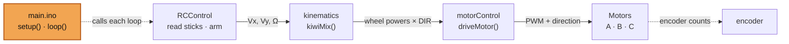
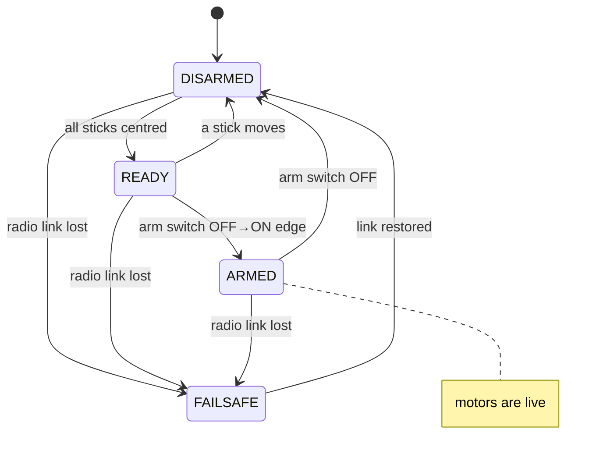
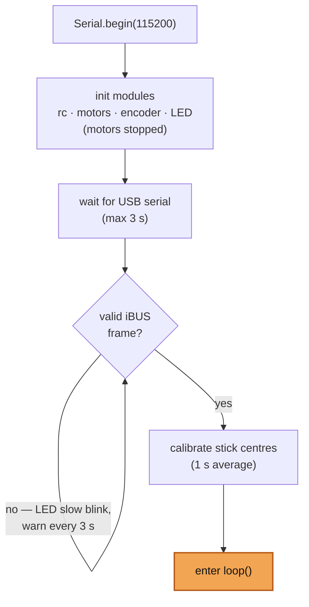
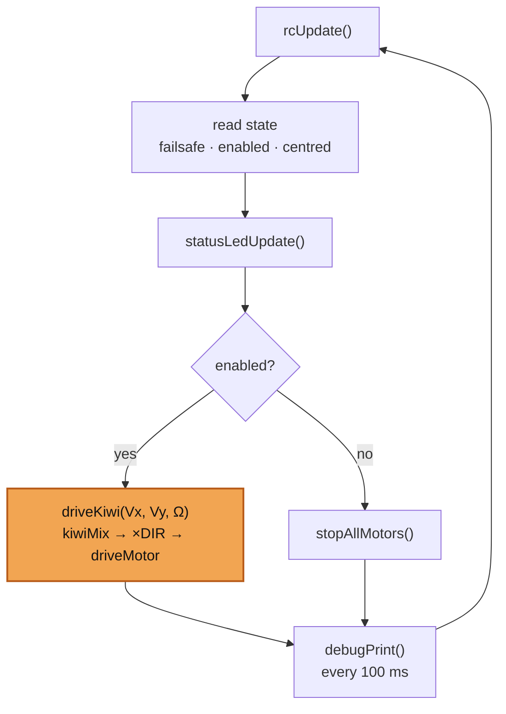

<div align="center">

# 🤖 TurtleBot IITD — Kiwi Drive Firmware Guide

**A plain-language walkthrough of the robot's firmware:
what the hardware is, which wire goes where, and how each module does its job.**

`Teensy 4.1` · `3-wheel kiwi drive` · `FlySky iBUS radio` · `2 × L298N` · `115200 baud`

</div>

---

The robot is a **kiwi drive** — a round chassis with three omni-wheels spaced 120°
apart. Unlike a car, it can slide sideways and spin at the same time. A **Teensy
4.1** is the brain, a **FlySky** radio is the remote control, and two **L298N**
H-bridge boards push current into the three geared motors.

> [!NOTE]
> This document renders best on **GitHub** (or any Markdown viewer with Mermaid
> support), where the diagrams below appear as real graphics. In a plain text editor
> the ` ```mermaid ` blocks show as code — that's expected.

## Contents

- [A. Hardware wiring — block diagram](#a-hardware-wiring--block-diagram)
- [B. Pin mapping table](#b-pin-mapping-table)
- [C. How the firmware is organised](#c-how-the-firmware-is-organised)
- [1. RC Control — reading the remote](#1-rc-control--reading-the-remote)
- [2. Kinematics — turning sticks into wheel speeds](#2-kinematics--turning-sticks-into-wheel-speeds)
- [3. Motor Control — driving the H-bridges](#3-motor-control--driving-the-h-bridges)
- [4. Encoders — measuring how far each wheel turned](#4-encoders--measuring-how-far-each-wheel-turned)
- [5. Diagnostics — the LED and serial output](#5-diagnostics--the-led-and-serial-output)
- [6. Startup Sequence — the safe boot](#6-startup-sequence--the-safe-boot)
- [7. main.ino — putting it together](#7-mainino--putting-it-together)
- [Quick reference: the arm ritual](#quick-reference-the-arm-ritual)

---

## A. Hardware wiring — block diagram

Trace the signal from your thumb to the wheel: you move a stick, the radio sends it
over the air, the receiver hands it to the Teensy as serial data, the Teensy does
some maths, and the motor drivers turn that into current. Separately, each motor's
encoder streams position pulses back to the Teensy.

```mermaid
flowchart LR
    TX["Transmitter<br/>FlySky FS-i6"] -->|"2.4 GHz radio"| RX["Receiver<br/>FS-iA6B"]
    RX -->|"iBUS · one wire → pin 0"| T["Teensy 4.1<br/>(brain)"]:::brain
    T -->|"PWM + direction"| D1["L298N #1<br/>Motors A · B"]
    T -->|"PWM + direction"| D2["L298N #2<br/>Motor C"]
    D1 --> MA["Motor A ⟳enc"]
    D1 --> MB["Motor B ⟳enc"]
    D2 --> MCm["Motor C ⟳enc"]
    MA -. "quadrature counts" .-> T
    MB -. .-> T
    MCm -. .-> T
    T -->|"pin 13"| LED["Status LED"]
    BAT["12 V battery"] -. "12 V motor rail" .-> D1 & D2
    classDef brain fill:#f2a552,stroke:#b85c1a,color:#111,stroke-width:2px
```

**Reading it:** the solid arrows are the *command* travelling out to the motors; the
dashed arrows back to the Teensy are *feedback* from the encoders. The status LED and
the USB serial cable (not shown) are how the robot talks back to you.

> [!WARNING]
> The Teensy 4.1 is **not 5 V tolerant**. Encoder VCC must be **3.3 V**. Only the
> L298N boards see 5 V (logic) and 12 V (motors). GND is shared by everything.

---

## B. Pin mapping table

Everything the firmware touches on the Teensy, in pin order. "Configuration" is how
the pin is set up in code; "Used for" is what it connects to. Every value here comes
from `robot_config.h`.

| Pin | Configuration | Used for / sensor | Comment |
|----:|---------------|-------------------|---------|
| 0  | Serial RX (`Serial1`) | iBUS signal from the receiver | The entire radio link arrives on this one pin |
| 1  | Serial TX (idle)      | `Serial1` transmit | Unused — iBUS only needs to be read |
| 2  | PWM output | `EN_B` — Motor B speed | Enable pin of L298N #1, channel B |
| 3  | Digital output | `IN4` — Motor B direction | L298N #1 |
| 4  | Digital output | `IN3` — Motor B direction | L298N #1 |
| 5  | PWM output | `EN_C` — Motor C speed | Enable pin of L298N #2 |
| 6  | Digital output | `IN2` — Motor A direction | L298N #1 |
| 8  | Digital output | `IN1` — Motor A direction | L298N #1 |
| 9  | PWM output | `EN_A` — Motor A speed | Enable pin of L298N #1, channel A |
| 10 | Digital output | `IN3_C` — Motor C direction | L298N #2 |
| 11 | Digital output | `IN4_C` — Motor C direction | L298N #2 |
| 12 | Input + interrupt | `ENC_B1` — Motor B encoder, channel 1 | Interrupt fires here to count |
| 13 | Digital output | On-board status LED | Built into the Teensy |
| 14 | Input | `ENC_B2` — Motor B encoder, channel 2 | Tells the counter which way |
| 15 | Input + interrupt | `ENC_A1` — Motor A encoder, channel 1 | Counting interrupt |
| 16 | Input | `ENC_A2` — Motor A encoder, channel 2 | Direction bit |
| 17 | Input + interrupt | `ENC_C1` — Motor C encoder, channel 1 | Counting interrupt |
| 18 | Input | `ENC_C2` — Motor C encoder, channel 2 | Direction bit |

**Notice the pattern:** each motor uses **five** pins — one PWM (speed), two digital
(direction), and two encoder (one to count, one to sense direction).

---

## C. How the firmware is organised

The firmware used to be a single long sketch. It is now split so that each file has
one clear responsibility and a small public API. `main.ino` is kept thin on purpose —
it holds only `setup()` and `loop()` and calls into the modules.

The heart of it is a **left-to-right pipeline** that runs every loop:



| File | One-line job |
|------|--------------|
| `RCControl.*` | Read the radio, clean up the sticks, and decide when it's safe to arm. |
| `kinematics.*` | Pure maths: convert a movement request into three wheel speeds. |
| `motorControl.*` | Convert one wheel speed into the pins an L298N understands. |
| `encoder.*` | Count encoder pulses and report distance travelled. |
| `diagnostics.*` | Blink the status LED and print debug text. |
| `startupSequence.*` | The blocking boot flow that runs before driving is allowed. |
| `main.ino` | Wire everything together in `setup()` / `loop()`. |
| `robot_config.h` | All pins, channels and tuning constants (shared, unchanged). |
| `IBusReader.h` | Low-level parser for the FlySky iBUS byte stream (shared). |

---

## 1. RC Control — reading the remote

**File:** `RCControl.cpp` / `RCControl.h`

### What it does

This is the only part of the firmware that talks to the radio. It hides the messy
details — the serial protocol, the raw numbers, the safety rules — and hands the rest
of the program three clean values and a simple "are we allowed to drive?" answer.

### The signal it receives

The FlySky receiver speaks **iBUS**: instead of one wire per channel, it packs all
channels into a 32-byte packet sent down a single wire about every 7 ms. Raw stick
values arrive as numbers around **1000 (min) to 2000 (max)**, resting near 1500.
Three of them matter:

| Stick | Becomes | Symbol |
|-------|---------|--------|
| Right stick, left ↔ right | Sideways slide | **Vx** |
| Right stick, up ↕ down | Forward / back | **Vy** |
| Left stick, left ↔ right | Spin in place | **Ω** (omega) |

A fourth channel is a two-position switch used as the **arm / kill switch**.

### Cleaning up a stick

Raw radio numbers are never perfect, so each one is reshaped into a tidy value from
**−1.0 to +1.0**:

1. **Calibrate the centre** — average each stick for one second at boot to learn where
   "released" sits, then keep nudging it while disarmed so drift never matters.
2. **Apply a deadzone** — movements within ±30 counts of centre count as zero, so a
   slightly-off stick doesn't creep the robot.
3. **Scale to ±1.0** — the stick's full throw maps to full command.

### Deciding when to arm

Turning the motors on is deliberately awkward so it can't happen by accident. Two
conditions must be true at the same instant: **every stick centred**, *and* the arm
switch **freshly flipped OFF → ON**. If the link drops (**failsafe**), the robot
disarms and stops.



### The API it offers

| Function | Meaning |
|----------|---------|
| `rcInit()` | Start the iBUS serial link. |
| `rcCalibrateCenters()` | Learn the resting stick positions (1-second average). |
| `rcUpdate()` | Call every loop: read radio, run arm logic, track drift. |
| `rcVx()` `rcVy()` `rcOmega()` | The three cleaned-up control values, −1…+1. |
| `rcEnabled()` | `true` only when armed, switch on, and link healthy. |
| `rcFailsafe()` `rcArmed()` `rcSticksCentered()` | Individual state checks. |

---

## 2. Kinematics — turning sticks into wheel speeds

**File:** `kinematics.cpp` / `kinematics.h`

### What it does

Given a movement request — some sideways (Vx), some forward (Vy), some spin (Ω) — this
module works out how fast and which way each wheel must turn. It is **pure maths**: no
pins, no hardware, so it is easy to reason about and test.

### The wheel layout

Looking down from above, wheel **C** is at the front with **A** and **B** behind it,
all 120° apart. (Mermaid can't place shapes at exact angles, so this one stays as a
sketch.)

```
                FRONT
               C (90°)
              /       \
             /         \
        A (210°)     B (330°)

     Vy ▲                Vx points right →
        │                Ω is a counter-clockwise spin ↺
        └──▶ Vx
```

Standard convention: 0° is the robot's right (+Vx), 90° is the front (+Vy), Ω is
counter-clockwise.

### The mixing formula

Each wheel only "feels" the part of the motion along its own direction, plus its share
of the spin:

```
   Motor C  =  −Vx                    +  Ω
   Motor A  =   0.5·Vx  −  0.866·Vy   +  Ω
   Motor B  =   0.5·Vx  +  0.866·Vy   +  Ω
```

(`0.866` is √3⁄2, from the 120° geometry.) Push the right stick right and Vx dominates;
push it forward and Vy dominates; push the left stick sideways and Ω spins the robot.

### Keeping it in range

Combining a big slide with a big spin can ask a wheel for more than 100%. The module
finds the largest of the three values and, if it's above 1.0, divides **all three** by
it — the *direction* stays exactly right, the robot just can't exceed full speed.
`kiwiMix()` always returns values between −1.0 and +1.0.

> [!NOTE]
> **Wiring vs. maths:** `kiwiMix()` ignores how the motors are physically wired.
> `main.ino` multiplies each result by that motor's direction constant (`DIR_A_CW`,
> `DIR_B_CW`, `DIR_C_CW` from config) before sending it out, so a positive number always
> spins the wheel the way the maths expects.

### The API it offers

| Function | Meaning |
|----------|---------|
| `kiwiMix(Vx, Vy, Omega)` | Returns `WheelPowers`: `.front_C`, `.backLeft_A`, `.backRight_B`, each −1…+1. |

---

## 3. Motor Control — driving the H-bridges

**File:** `motorControl.cpp` / `motorControl.h`

### What it does

The bottom layer. It takes a single signed number (−1.0 to +1.0) for one motor and
turns it into the three signals an L298N channel needs: two direction pins and one PWM
speed pin. It knows nothing about kinematics or the radio.

### How a number becomes motion

The **sign** chooses direction; the **size** becomes PWM duty (scaled to 255 = full):

| Command | Direction pin 1 | Direction pin 2 | Speed (PWM) | Effect |
|---------|-----------------|-----------------|-------------|--------|
| positive | HIGH | LOW  | size × 255 | spin forward |
| negative | LOW  | HIGH | size × 255 | spin backward |
| zero     | LOW  | LOW  | 0 | stop |

So `+0.5` is "forward at half power", `−1.0` is "backward, full power", `0` is "stop".

### The API it offers

| Function | Meaning |
|----------|---------|
| `motorsInit()` | Set all motor pins as outputs and leave everything stopped. |
| `driveMotor(en, in1, in2, power)` | Drive one L298N channel with a signed power. |
| `stopAllMotors()` | Stop all three wheels at once. |

`stopAllMotors()` is the safe default: it runs at boot, whenever the robot isn't
enabled, and whenever the radio link is lost.

---

## 4. Encoders — measuring how far each wheel turned

**File:** `encoder.cpp` / `encoder.h`

### What it does

Every motor has a **quadrature encoder** — a sensor with two output channels that
click as the shaft turns. Counting the clicks tells the firmware how far a wheel has
rolled; comparing the two channels tells it which way. This module keeps a running
count per wheel and can convert it to millimetres.

> [!NOTE]
> This module is **new**. The encoder pins and counts-per-revolution were already in
> `robot_config.h`, but nothing was reading them until now — it was built from those
> existing constants.

### How quadrature counting works

The two channels (C1 and C2) are identical square waves, one lagging the other by a
quarter step. An interrupt fires on every rising edge of C1; at that instant the
firmware reads C2 — high or low tells it the direction. (A waveform, which Mermaid
can't draw, so it stays as a sketch.)

```
              C1 rising edge (interrupt fires)
                     │
          ┌────┐     ▼    ┌────┐    ┌────┐
   C1 ────┘    └──────────┘    └────┘    └───
                     │
   C2 ──────┐   ┌────┴──────┐   ┌────┐   ┌───
            └───┘           └───┘    └───┘
                     │
        read C2 now →  HIGH = count +1,   LOW = count −1
```

Each count is about **0.055 mm** of travel at the rim (~2115 counts per turn of a
37.3 mm wheel).

### The API it offers

| Function | Meaning |
|----------|---------|
| `encoderInit()` | Set up the pins and attach the counting interrupts. |
| `encoderCount('A')` | Signed running count for a wheel (`'A'`, `'B'`, `'C'`). |
| `encoderDistanceMM('A')` | That count converted to millimetres. |
| `encoderReset('A')` / `encoderResetAll()` | Zero the count(s). |

> [!WARNING]
> **If a wheel counts backwards:** the +/− direction depends on how C1 and C2 are
> wired. If driving a wheel forward makes its count go *down*, swap that motor's two
> encoder wires or flip the sign in its interrupt handler.

### Reference numbers

| Quantity | Value |
|----------|-------|
| Counts per wheel revolution | ~2115 (±10) |
| Wheel diameter (rolling) | 37.3 mm |
| Distance per count | ~0.055 mm |
| Counts for a full 360° robot spin | A: 7566 · B: 7813 · C: 7634 |
| Robot radius (centre to wheel) | 84 mm |

---

## 5. Diagnostics — the LED and serial output

**File:** `diagnostics.cpp` / `diagnostics.h`

### What it does

How the robot reports its state — first through the single on-board LED (readable
across the room, no laptop needed), and second through detailed text on the USB serial
monitor (for bench debugging).

### The LED language

Patterns are checked in priority order, so a lost link always shows through:

| LED behaviour | What it means | Your move |
|---------------|---------------|-----------|
| 🔵 Slow blink (½ second) | Still hunting for the radio link | Check receiver power / binding / wiring |
| 🟡 Fast blink (~7 Hz) | Link good, but a stick is off-centre | Centre all sticks |
| 🟢 Solid ON | Centred and ready to arm | Flip the arm switch OFF then ON |
| ⚫ Solid OFF | **Armed — motors are live** | Be careful |
| 🔴 Frantic blink (~16 Hz) | Failsafe — the link dropped | Motors are stopped; fix the link |

### The serial dump

About ten times a second (when not in failsafe) it prints one block showing the
cleaned stick values, the raw channel numbers, the live calibration centres, and — for
each wheel — the commanded power and the actual PWM being sent. If the robot moves
oddly, this line usually shows why.

### The API it offers

| Function | Meaning |
|----------|---------|
| `diagInit()` | Configure the LED pin. |
| `statusLedUpdate(failsafe, enabled, centred)` | Pick and show the right pattern. |
| `diagSetWheelDebug(...)` | Hand the latest wheel powers/PWM in for the next print. |
| `debugPrint(enabled, failsafe)` | Print the full state block (call throttled). |

---

## 6. Startup Sequence — the safe boot

**File:** `startupSequence.cpp` / `startupSequence.h`

### What it does

Runs once, before the main loop is allowed to drive anything. Its whole reason to
exist is safety: earlier versions could twitch on power-up or arm on garbage data. The
startup sequence guarantees the radio link is genuinely alive before the motors can
move.



The iBUS wait is a deliberate hold: nothing past it happens until the link is proven
good, so the robot can never calibrate off missing or corrupt data.

### The API it offers

| Function | Meaning |
|----------|---------|
| `startupSequence()` | Run the whole blocking boot flow above. |

---

## 7. main.ino — putting it together

**File:** `main.ino`

`main.ino` is intentionally short — no real logic of its own. It initialises each
module, then calls them in the right order.

**`setup()` — run once:** start serial → `rcInit()` → `motorsInit()` (motors stopped)
→ `encoderInit()` → `diagInit()` → `startupSequence()`.

**`loop()` — run forever:**



The only branch that ever moves the robot is the **enabled** one. Disarmed, un-centred
sticks, switch off, or a lost link all funnel into `stopAllMotors()`.

---

## Quick reference: the arm ritual

> [!TIP]
> **To make the robot go, in order:**
> 1. Power on. The LED **slow-blinks** while it looks for the receiver.
> 2. Once linked, **centre every stick**. The LED goes **solid ON** = ready.
> 3. Flip the arm switch **OFF, then ON**. The LED goes **solid OFF** = armed, motors live.
> 4. Drive: right stick slides / moves forward-back, left stick spins.
> 5. To stop instantly, flip the arm switch OFF (or let the link drop).
>
> Flip the arm switch while a stick is off-centre and nothing arms — re-centre, then
> flip OFF → ON again.

---

<div align="center">

*This guide describes the modular firmware in `main/`.
All pins, channels and constants come from `robot_config.h`.*

</div>
