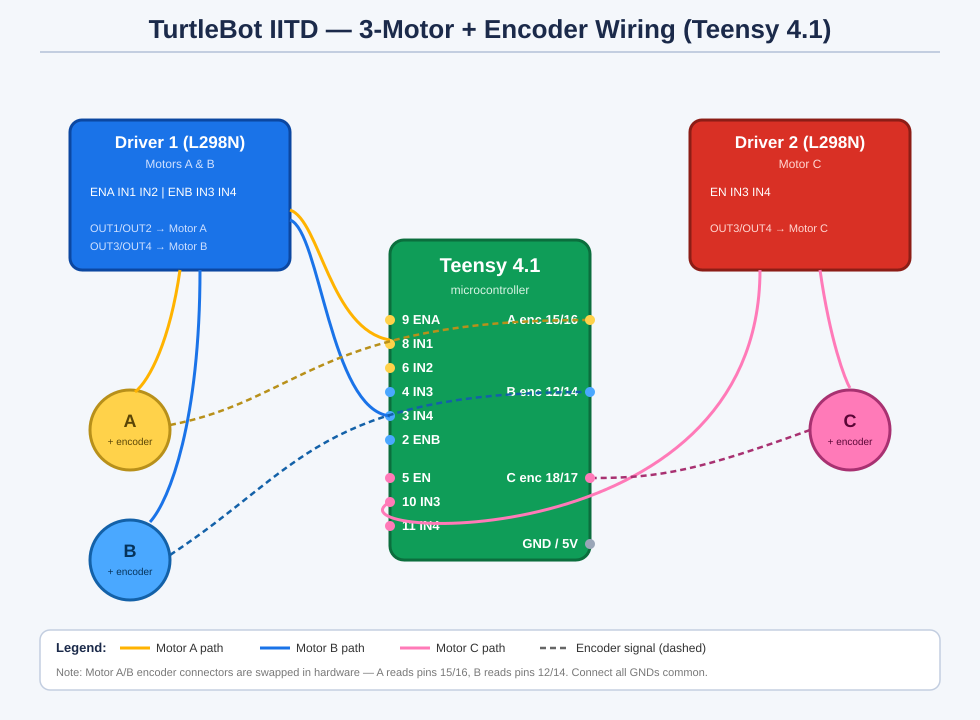

# TurtleBot IITD — 3-Motor + Encoder Test (Teensy 4.1)

Test sketch driving **three DC motors** across **two L298N-style drivers**, with
**quadrature encoder feedback** on all three motors.

- **Driver 1** → Motors **A** and **B**
- **Driver 2** → Motor **C**

## Wiring Diagram

## Pin Configuration

### 🟡🔵 Driver 1 — Motors A & B

| Signal | Teensy Pin | Driver Pin | Purpose |
|:------:|:----------:|:----------:|---------|
| 🟡 ENA | **9**  | ENA | Motor A speed (PWM) |
| 🟡 IN1 | **8**  | IN1 | Motor A direction |
| 🟡 IN2 | **6**  | IN2 | Motor A direction |
| 🔵 IN3 | **4**  | IN3 | Motor B direction |
| 🔵 IN4 | **3**  | IN4 | Motor B direction |
| 🔵 ENB | **2**  | ENB | Motor B speed (PWM) |

### 🔴 Driver 2 — Motor C

| Signal | Teensy Pin | Driver Pin | Purpose |
|:------:|:----------:|:----------:|---------|
| 🔴 EN  | **5**  | ENB | Motor C speed (PWM) |
| 🔴 IN3 | **10** | IN3 | Motor C direction |
| 🔴 IN4 | **11** | IN4 | Motor C direction |

### ⚙️ Encoders

> ⚠️ **Note:** Motor A and Motor B encoder connectors are physically swapped,
> so in the code **Motor A reads pins 15/16** and **Motor B reads pins 12/14**.

| Motor | Channel C1 (interrupt) | Channel C2 |
|:-----:|:----------------------:|:----------:|
| 🟡 A  | **15** | **16** |
| 🔵 B  | **12** | **14** |
| 🔴 C  | **18** | **17** |

### 🔌 Power (both drivers)

| Connection | Notes |
|------------|-------|
| Driver GND → Teensy GND | Common ground (required) |
| Logic 5V | Driver logic supply |
| Motor supply | Battery / motor voltage (e.g. 12V) |
| Encoder VCC / GND | Per encoder rating (3.3V or 5V) + common GND |

## Behaviour

The sketch loops through:

1. **All motors forward** (half speed, 2 s) → prints encoder counts
2. **All motors reverse** (half speed, 2 s) → prints encoder counts
3. **Motor A** ramp 0 → 255 → prints count
4. **Motor B** ramp 0 → 255 → prints count
5. **Motor C** ramp 0 → 255 → prints count

Encoder counts increase on **forward** and decrease on **reverse**.
Open the Serial Monitor at **115200 baud** to watch the output.

## Files

| File | Description |
|------|-------------|
| `teensy_motor_test.ino` | Full 3-motor + encoder test |
| `single_motor_check/single_motor_check.ino` | Runs one motor + encoder at a time (edit pins at top) |
